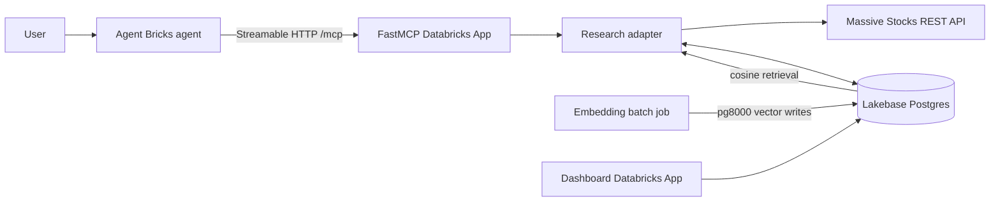

# Signal Desk — AI Stock Market Research Assistant

A Databricks capstone implementation that evolves the original standalone prototype combining a FastMCP
server, Massive Stocks data, Lakebase Postgres, managed Databricks AI Search, an Agent Bricks agent,
and a small activity dashboard. The capstone proposal remains a new-project
proposal; the implementation inventory and migration decisions are recorded in
`docs/architecture/EXISTING_CODE_INVENTORY.md`.

## Phase 0 foundation

Phase 0 adds versioned contracts, characterization tests, architecture
decisions, CI/quality gates, a multi-environment Declarative Automation Bundle,
and a credential-safe feasibility harness. Start with:

```bash
make install
make test
```

Workspace validation always requires an explicit user-selected profile:

```bash
databricks bundle validate --strict --target dev --profile '<selected-profile>'
```

See `docs/phase0/RESOURCE_BOOTSTRAP.md` and
`docs/phase0/FEASIBILITY_REPORT.md` before deploying or running live checks.

## Architecture



The source API is [Massive Stocks](https://massive.com/docs/rest/stocks). The
client uses the official ticker overview, custom daily aggregate bars, news,
SEC EDGAR index, income statement, and balance sheet endpoints. Massive requires an API key;
the key is read from the Databricks secret `massive/api-key` and is never
committed. Fundamentals availability depends on the Massive subscription.

## MCP tools

| Tool | Capability |
|---|---|
| `get_stock_performance` | Most recent entitled snapshot plus daily bars, return, high and low |
| `get_company_research` | Company profile, news and available reported fundamentals |
| `compare_stocks` | Like-for-like price-action comparison for 2–5 tickers |
| `get_watchlist` | User-scoped watchlist with latest locally synced price |
| `update_watchlist` | Confirmed, idempotent add/remove mutation |
| `save_research_note` | Confirmed, idempotent ticker-note write |
| `save_analysis_report` | Confirmed, idempotent multi-ticker report write |
| `semantic_research` | Hybrid managed AI Search over attributable SEC/news passages |
| `get_notable_updates` | Price moves and articles since the user's last visit |

Tool functions are intentionally thin. `research_broker.py` owns HTTP calls,
normalization, persistence, calculations, and safe error envelopes.
User-scoped tools derive ownership from Databricks forwarded identity and do not
accept a `user_email` argument. Every consequential write requires
`confirmed=true` and a stable idempotency key; retries of the same request return
the original result without repeating the write.

## Lakebase schema and context engineering

The requested operational tables are `users`, `watchlists`,
`watchlist_tickers`, `companies`, `price_snapshots`, `news_articles`,
`research_notes`, and `analysis_reports`. `stock_research_mcp_traces` and the
agent session/event tables support auditability and analytics. The governed
research corpus and its managed search index stay in Unity Catalog rather than
using Lakebase as the vector store.

Company profiles keep normalized research columns plus raw JSON provenance.
News has a stable Massive article ID, ticker, narrative fields, publisher,
published time, sentiment metadata, raw payload, and optional full text.
Snapshots preserve OHLCV/VWAP and derived prior-session changes. Notes and
reports are always tied to a user; reports can span several tickers.

The Spark research pipeline owns one section-aware parent/child chunk contract.
It persists contextual embedding text separately from faithful passage text. A
small Spark publish job idempotently MERGEs those chunks into the CDF- and
row-tracking-enabled `research_search_documents` Delta table supported by AI
Search. A triggered Delta Sync index uses `databricks-qwen3-embedding-0-6b`,
hybrid retrieval, metadata filters, and reranking. The compatibility-named
embedding job requests an incremental managed-index sync; it does not load a
local model or write pgvector rows.

## Repository layout

```text
mcp_server/   FastMCP app, Massive client, adapter, Lakebase helper, DDL
jobs/         ingestion, certification, and managed-index synchronization jobs
agent/        system prompt, external-MCP config, evaluation scenarios
dashboard/    independent Flask Databricks App
ingestion/    market-wide landing job entry points
pipelines/    Lakeflow Spark Declarative Pipeline definitions
shared/       versioned contracts and runtime configuration
resources/    Databricks bundle resource definitions
tests/        cross-component characterization and contract tests
tools/        feasibility and repository-safety tooling
sql/          SQL setup guidance
```

## End-to-end setup

### 1. Configure local authentication

Install and authenticate the Databricks CLI/SDK, then run:

```bash
python setup_secrets.py --profile '<selected-profile>'
```

Paste a Massive API key and a standard Lakebase PostgreSQL URL. Grant the MCP
and dashboard App service principals `READ` on the required secret scopes. For
local-only execution, copy `mcp_server/.env.example` to `.env` and set
`MASSIVE_API_KEY` and `LAKEBASE_URL`; never commit that file.

### 2. Create the schema

Launch the MCP app once or run the Phase 4 migration preflight—its entry point
calls `lakebase.migrate()` idempotently. Versioned migrations create only
allowlisted `_srini` tables in the shared schema. The legacy pgvector table is
retained for migration compatibility but is not used by Phase 5 search.

### 3. Deploy the MCP server as its own Databricks App

Create an App whose source directory is `mcp_server/`. The included `app.yaml`
runs `stock_research_mcp_server.py`. Add the Massive and Lakebase secrets as
App resources/permissions, deploy, and verify:

```text
https://<stock-mcp-app>.aws.databricksapps.com/mcp
```

Use Databricks OAuth when registering the endpoint; do not expose it as a
public unauthenticated service.

### 4. Sync research data

Call `get_company_research` and `get_stock_performance` through an MCP inspector
or the agent for the tickers you want. These calls upsert profiles, news, and
daily price snapshots into Lakebase. Optional filing excerpts and earnings-call
summaries can be loaded into their columns by your approved filing/transcript
pipeline; the embedding job automatically includes them.

### 5. Synchronize semantic search

Deploy and run the serving-table publisher after the research pipeline has
created `silver_research_chunks`; then deploy the Vector Search endpoint/index
and run the synchronization job. The two-stage bootstrap is required because an
index source table must exist before the index resource can be created:

```bash
databricks bundle deploy -t dev -p dataexpertio_srini --select jobs.research_search_publish
databricks bundle run research_search_publish -t dev -p dataexpertio_srini
databricks bundle deploy -t dev -p dataexpertio_srini --select vector_search_endpoints.research_search --select vector_search_indexes.research_chunks --select jobs.research_embeddings
databricks bundle run research_embeddings -t dev -p dataexpertio_srini
```

The `research_refresh` orchestration publishes the Delta serving table and then
requests the triggered index sync after a successful pipeline update.

### 6. Register and test the Agent Bricks agent

In Agent Bricks:

1. Add an **External MCP server** using the MCP App `/mcp` URL and
   Streamable HTTP transport.
2. Select the nine tools listed in `agent/agent_bricks_config.yaml`.
3. Paste `agent/system_prompt.md` as the system instruction.
4. Replace the placeholder endpoint in `agent_bricks_config.yaml`.
5. Run every evaluation question and inspect the tool trace before accepting
   the answer. Confirm ticker, lookback and as-of date alignment.

### 7. Deploy the dashboard independently

Create a second Databricks App from `dashboard/`, grant only the Lakebase
secret permission, and deploy its included `app.yaml`. Databricks forwards the
signed-in user email; local development falls back to `demo@example.com`:

```bash
cd dashboard
pip install -r requirements.txt
LAKEBASE_URL='postgresql://...' python app.py
```

## Validation

From the repository root:

```bash
python -m compileall mcp_server jobs dashboard
pytest -q mcp_server/tests
```

For deployment acceptance, demonstrate price research, multi-ticker
comparison, semantic thesis retrieval, watchlist mutation, saved research,
notable updates, and a clean invalid-ticker/entitlement failure.

## Limitations and improvements

- Data latency, history, news, and financial statements vary by Massive plan.
- The tool requests Massive's current single-ticker snapshot, but fields and
  latency depend on plan entitlements; it falls back explicitly to the latest
  eligible daily aggregate. WebSockets would improve continuous intraday use.
- Massive company overview is not a full SEC filing/transcript feed. The schema
  deliberately accepts approved filing excerpts and earnings summaries, but a
  production system should add SEC EDGAR/transcript ingestion with source URLs,
  filing dates, and licensing controls.
- The job re-embeds candidate text each run before deterministic upsert. At
  scale, filter by content hash first and use a managed job schedule.
- A 5% notable-move threshold is intentionally simple. Production alerting
  should adjust for volatility, corporate actions, market sessions, and user
  preferences.
- The assistant supports research, not trade execution or personalized advice.
  Add formal evaluation, role-based access, retention policies, and human review
  before regulated use.
