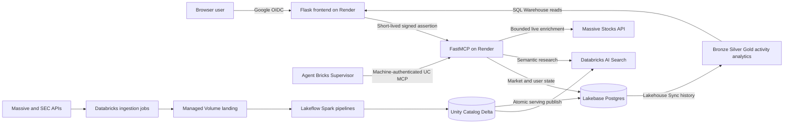

# Signal Desk AI Stock Market Research Assistant

Signal Desk is an authenticated stock-research application built for the
Databricks AI capstone. It combines governed market and research pipelines,
Databricks AI Search, Lakebase operational state, a nine-tool FastMCP service,
an Agent Bricks Supervisor, and a Flask web application.

The deployed application is available at
[signal-desk-frontend-s88i.onrender.com](https://signal-desk-frontend-s88i.onrender.com/).
Access is restricted to configured Google OIDC users. The application supports
research and evidence review; it does not execute trades or provide personalized
investment advice.

## Current implementation

- **Frontend:** Flask on Render with Google OIDC, secure sessions, CSRF
  protection, request IDs, restrictive security headers, and short-lived signed
  assertions for downstream MCP calls.
- **MCP service:** FastMCP on Render with six read tools and three explicitly
  confirmed, idempotent write tools.
- **Market serving:** request-time price history is read from an atomically
  published Lakebase serving table.
- **Research serving:** SEC filing and news passages are retrieved from the
  accepted Databricks AI Search hybrid index with metadata filters, reranking,
  source URLs, and dates.
- **Operational state:** Lakebase stores users, watchlists, notes, reports,
  action events, traces, and the shared Massive API quota ledger in suffix-owned
  `_srini` tables.
- **Analytics:** Lakebase history is synchronized to Unity Catalog and processed
  into five Gold metric families displayed by the frontend.
- **Agent:** an Agent Bricks Supervisor uses the governed UC MCP service backed
  by the deployed Render MCP endpoint.
- **Hosting:** Render runs only the frontend and MCP web services. Databricks
  retains ingestion, Lakeflow pipelines, Unity Catalog data, SQL Warehouse,
  AI Search, Lakehouse Sync analytics, and Supervisor processing.

## Architecture


```mermaid
flowchart LR
  U[Browser user] -->|Google OIDC| F[Flask frontend on Render]
  F -->|Short-lived signed assertion| M[FastMCP on Render]
  S[Agent Bricks Supervisor] -->|Machine-authenticated UC MCP| M

  M -->|Market and user state| L[(Lakebase Postgres)]
  M -->|Semantic research| V[Databricks AI Search]
  M -->|Bounded live enrichment| P[Massive Stocks API]

  P2[Massive and SEC APIs] --> I[Databricks ingestion jobs]
  I --> R[Managed Volume landing]
  R --> D[Lakeflow Spark pipelines]
  D --> C[(Unity Catalog Delta)]
  C --> V
  C -->|Atomic serving publish| L
  L -->|Lakehouse Sync history| A[Bronze Silver Gold activity analytics]
  A -->|SQL Warehouse reads| F
```

The source systems are
[Massive Stocks](https://massive.com/docs/rest/stocks) for market, company, and
article data and SEC EDGAR/data.sec.gov for filings and Company Facts. API keys,
OAuth credentials, database URLs, assertion keys, and machine credentials are
stored only in approved secret stores or protected deployment configuration.

## User functionality

The authenticated frontend provides four connected workflows:

1. **Research** — view ticker performance, compare two to five tickers on a
   common time window, or retrieve filing and article evidence for a research
   question.
2. **Watchlist and signals** — add or remove tickers, view the latest locally
   served prices, and review notable moves and new articles.
3. **Saved research** — persist user-owned notes and multi-ticker reports after
   explicit confirmation.
4. **Usage analytics** — review daily active researchers, tool usage and P95
   latency, agent error rate, watchlist changes, and research saves.

Every user-owned read or write is scoped to the authenticated identity. Write
operations require confirmation and a stable idempotency key so retries do not
duplicate changes.

## MCP tool contract

| Tool | Capability |
|---|---|
| `get_stock_performance` | Return stored daily bars, latest price, period return, high, low, source, and as-of context |
| `get_company_research` | Return a company profile, recent news, SEC links, and available reported fundamentals |
| `compare_stocks` | Compare two to five tickers over the same bounded window |
| `get_watchlist` | Read the authenticated user's watchlist with locally served price facts |
| `semantic_research` | Retrieve attributable filing and article passages with optional ticker, source-type, and date filters |
| `get_notable_updates` | Return watchlist price moves and new articles since the user's previous visit |
| `update_watchlist` | Add or remove one ticker after explicit confirmation |
| `save_research_note` | Save a ticker-linked note after explicit confirmation |
| `save_analysis_report` | Save a multi-ticker report and provenance context after explicit confirmation |

Tool definitions are in `mcp_server/stock_research_mcp_server.py`. Business
logic, normalization, calculations, serving adapters, and safe error envelopes
are implemented behind the tool layer rather than in the tool wrappers.

## Data workflows

The active Databricks bundle is defined by `databricks.yml` and includes jobs,
pipelines, storage, and AI Search resources. Application resources are excluded
from this data-plane deployment.

### Market workflow

`market_daily_refresh` runs at 06:00 America/Los_Angeles on weekdays. It lands
recent Massive grouped-daily data, refreshes the market Lakeflow pipeline,
publishes the governed Delta serving table, and atomically updates the Lakebase
market serving table.

The accepted volume run reconciled 1,255,677 Bronze rows to 1,255,489 unique
Silver `(ticker, trading_date)` rows plus 188 deterministic quarantines across
81 manifest dates.

### Research workflow

`research_refresh` runs every six hours. It ingests SEC filings and Company
Facts plus Massive articles, refreshes the research pipeline, publishes the
canonical Delta search source, and triggers the AI Search index sync.

The bounded accepted run produced 2 companies, 12 filings, 57,806 facts, 86
articles, 549 article/ticker links, and 507 traceable research chunks. The
canonical searchable serving corpus contains 393 rows. The 51-case AI Search
evaluation passed Recall@5 1.0000, MRR 0.9902, nDCG@5 0.9928, with no provenance
or filter violations.

### Activity analytics workflow

`activity_analytics_refresh` runs every 30 minutes. It processes synchronized
Lakebase histories into pseudonymous Bronze and Silver activity records and the
five Gold metric families consumed by the frontend. Analytics never stores
tokens, API keys, connection URLs, direct email addresses, or authored note and
report bodies.

### API quota coordination

Databricks jobs and the Render MCP service share a fail-closed Lakebase rolling
window ledger for Massive API calls. The deployed cross-host acceptance test
recorded exactly five physical attempts, limited the rolling count to four, and
delayed the fifth attempt by 60.225 seconds.

## Repository layout

```text
agent/        Agent Bricks configuration, prompt, and evaluation fixtures
dashboard/    Flask frontend deployed to Render
docs/         Architecture decisions, runbooks, evidence, and release records
ingestion/    Massive, SEC, and article landing entry points
jobs/         Certification, publishing, and search synchronization jobs
mcp_server/   FastMCP service, adapters, authentication, Lakebase access, migrations
pipelines/    Market, research, and activity Lakeflow pipeline definitions
resources/    Databricks bundle job, pipeline, storage, and AI Search resources
shared/       Versioned contracts and runtime configuration
submission/   Capstone evidence report, screenshots, demo script, and upload package
tests/        Cross-component contract, security, deployment, and workflow tests
tools/        Acceptance, evaluation, safety, and reproducibility utilities
```

## Local development and validation

Python 3.11 through 3.14 and `uv` are supported. Install all application and
development dependencies, then run the local quality gates:

```bash
uv sync --extra mcp --extra dashboard --dev
uv run pytest -m "not integration and not e2e"
uv run ruff check .
```

Validate the two Render service builds, exact start commands, and health routes
in isolated environments:

```bash
uv run python tools/check_render_reproducibility.py --clean-install --process-smoke
```

Integration and end-to-end tests require explicitly configured external
services and are excluded from the default test command.

## Databricks deployment

Always select the intended Databricks CLI profile explicitly. Validate before
deploying:

```bash
databricks bundle validate --strict --target dev --profile '<selected-profile>'
databricks bundle deploy --target dev --profile '<selected-profile>'
```

The active bundle deploys only the data plane. See
`docs/IMPLEMENTATION_STATUS.md` for current workspace acceptance evidence and
`docs/release/REQUIREMENTS_TRACEABILITY.md` for the rubric-to-evidence map.

## Render deployment

The root `render.yaml` is the production Blueprint and defines exactly two
Python web services:

- `signal-desk-mcp`, with public health endpoint `/health` and authenticated MCP
  endpoint `/mcp`;
- `signal-desk-frontend`, with public health endpoint `/healthz` and Google OIDC
  callback `/oidc/callback`.

Both services use hash-pinned Python 3.11 dependency locks. Values marked
`sync: false` in `render.yaml` must be entered through protected Render
configuration and must never be committed. Follow
`docs/RENDER_DEPLOYMENT_RUNBOOK.md` for the deployment and acceptance procedure.

Both deployed services currently use Render Free instances. Pre-warm the MCP
service first and the frontend second before a live demonstration because an
idle service can require a cold start.

## Security boundaries

- Browser identity comes from Google OIDC and an explicit allowed-user list.
- The frontend creates one short-lived, request-bound RS256 assertion per MCP
  session; forged forwarded identity headers are ignored on Render.
- The Supervisor uses a separate fixed machine identity.
- User-owned Lakebase queries include ownership predicates.
- Write tools require both explicit confirmation and idempotency.
- External API rate-limit state fails closed if coordination is unavailable.
- Application responses use bounded inputs, safe error messages, request IDs,
  TLS-only external calls, and restrictive browser security headers.

## Known constraints

- Render Free instances can sleep and must be warmed before a timed demo.
- Market, news, and fundamentals availability depends on Massive subscription
  entitlements; unavailable values are reported as unavailable rather than zero.
- Lakebase full-text research retrieval did not meet the promotion threshold,
  so production semantic research correctly remains on Databricks AI Search.
- The shared classroom Lakebase role is broader than a production-specific
  runtime role. Application allowlists, ownership predicates, confirmation, and
  idempotency define the accepted capstone boundary.

## Documentation and evidence

- `docs/IMPLEMENTATION_STATUS.md` — chronological implementation and acceptance record
- `docs/release/REQUIREMENTS_TRACEABILITY.md` — capstone requirement evidence
- `docs/release/DEMO_CHECKLIST.md` — accepted demo and negative-test checklist
- `docs/release/DATA_DICTIONARY.md` — governed data and Lakebase table definitions
- `docs/release/TOOL_API_REFERENCE.md` — MCP and external API contract
- `docs/RENDER_DEPLOYMENT_RUNBOOK.md` — current split-host deployment procedure
- `submission/Signal_Desk_Capstone_Evidence.pdf` — grader-facing evidence report
